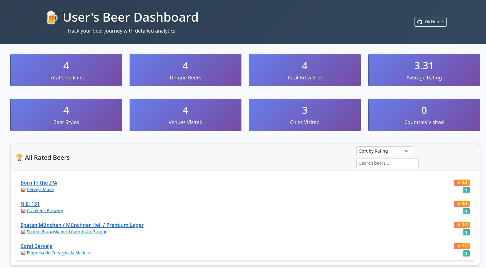
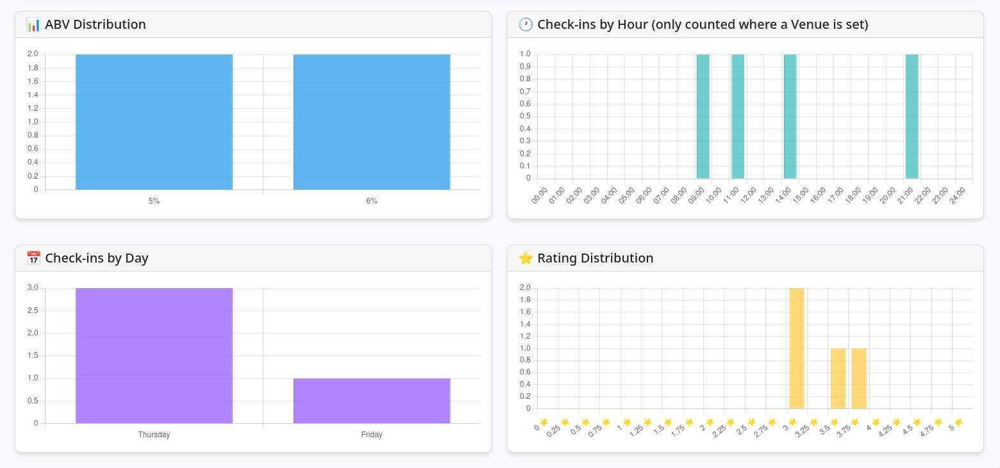
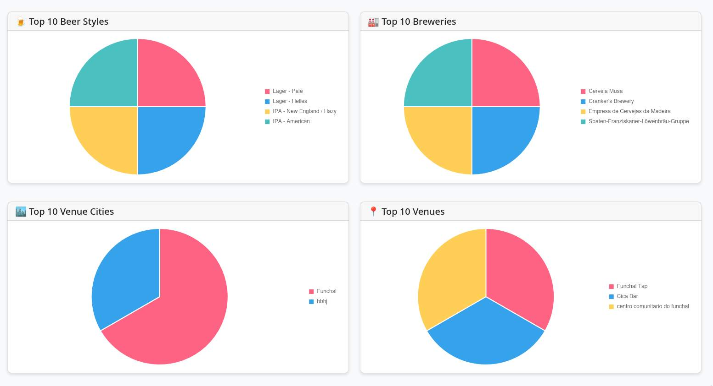
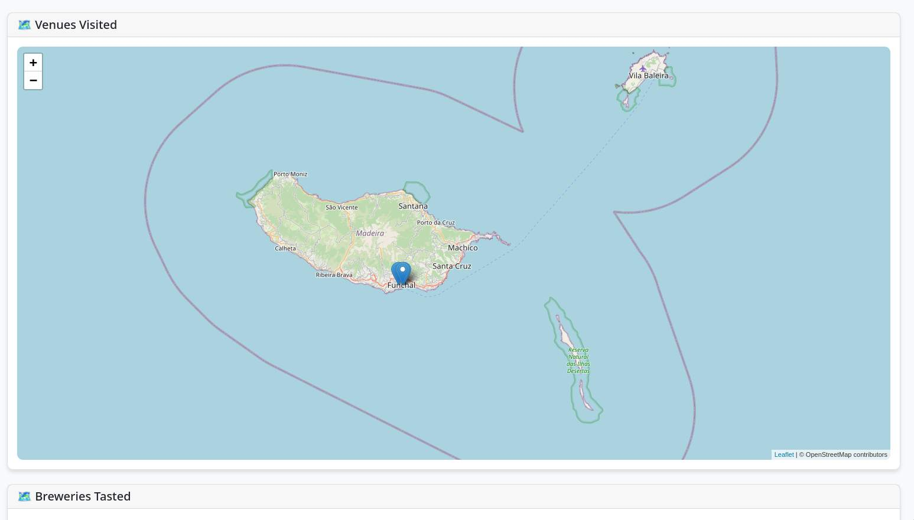

# Retappd 

## About

This is a simple Dashboard to display stats about my beer-based alcoholism.

Heavily inspired by [Sjaakbanaan's untappd-data-visualised project](https://github.com/sjaakbanaan/untappd-data-visualised/)

## 🚨⚠️🚨WARNING 🚨⚠️🚨 This was at least 70% VibeCoded.

I do not know a thing about HTML/CSS or Javascript and let the AI do its thing. If it's gross, don't blame me.

## Screenshots










## Installing

### Get Untappd data

YOU WILL NEED TO BE AN UNTAPPD INSIDER 💸💸💸.

You can export some of the data using Untappd' premium (and expensive) feature (https://untappd.com/user/xxxx/beers) as JSON,
and then run the import script.

`mkdir -p data ; ruby tools/import_json.sqlite /tmp/export.json data/retappd.sqlite`

You will miss some of the information that the Dashboard uses, though (such as Breweries locations).


### If you have already a working sqlite file with all your data exported

```
$ mkdir data
# Copy your retappd.sqlite file in data/
$ vim .env
RETAPPD_USERNAME="username"
RETAPPD_ALLOWED_HOSTS="retappd.domain.com,10.0.5.2"
# docker compose up -d
```
